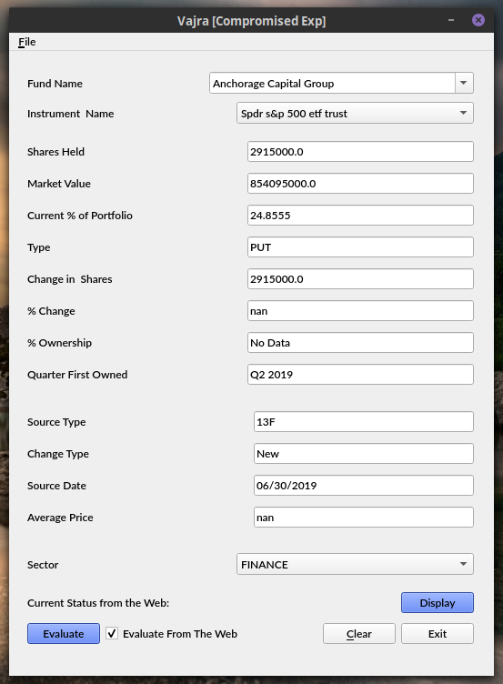
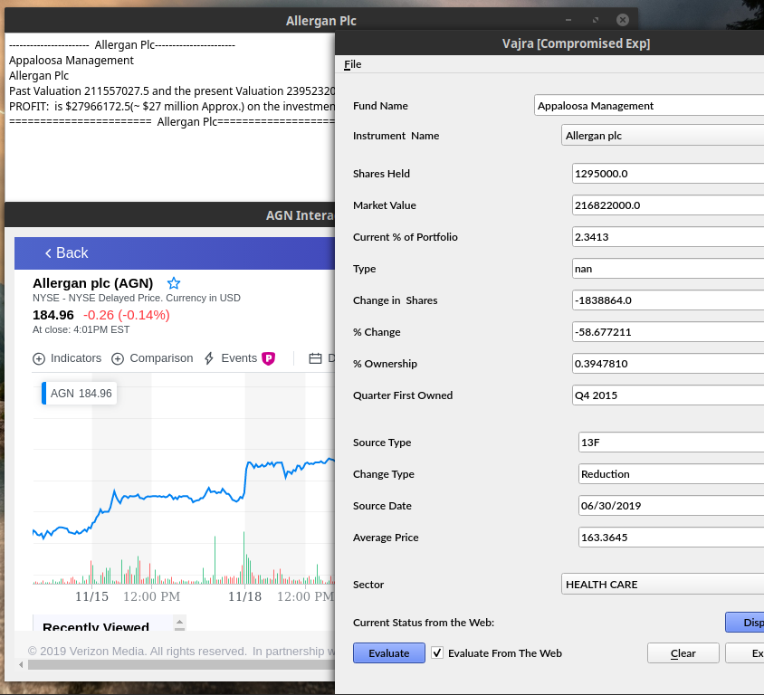
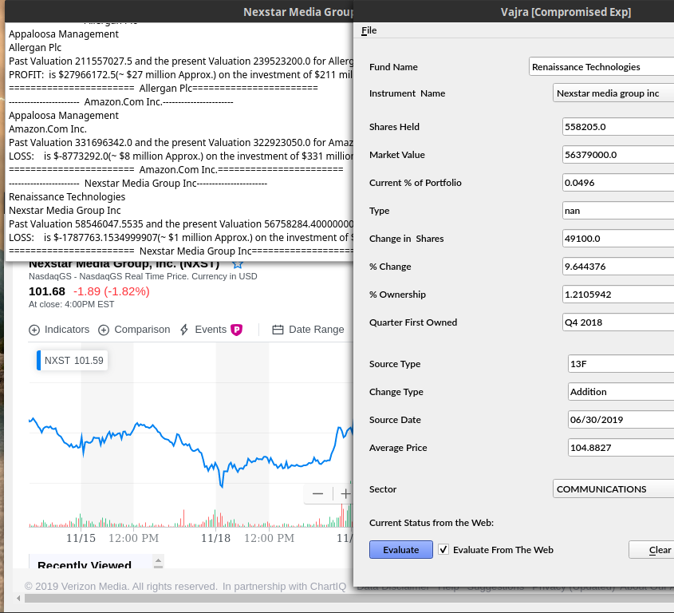

 

# VajraExp
        
This is one of the sample methods, i.e. the diluted version of the Exponential Analysis which comes under the Vajra family of routines, which has been demonstrated here. It checks the common hedge funds and other financial holdings' asset allocation, in this case it primarily consists of equities/ETFs in US Market and thereafter decides whether it is a good investment, it also calculates the opportunity of the maximum possible return, in a prescribed time-frame, though that is not illustrated in the program. The method, demonstrated here, is NOT a very good method in its isolation, it becomes more effective when used in conjunction with other main methods. Further, it is used when the instrument under consideration is a blue-chip and/or has a slow-but-steady type of growth planning. It specifically looks for the timing of the outward jump, which every such instrument demonstrates in its lifetime, this has been tried using a very crude example, sector-wise speaking, of Tencent Holdings Limited 0700.HK (do note the values of 0700.HK are taken from 2004-06-16 to 2016-12-15, just before its great leap forward). The main components of this method has been removed for obvious reasons, though enough is given as to provide the general route of logic.

>**[Background]**
It is the refined version of the first UI draft of the Vajra which was written in C#, Gtk, as to adjudicate the expectancy of the visual preferences of the client. ** Deprecated[** ~~I extended the classes involved as to provide a general GUI framework which would be easily extensible for the amateurs and professionals alike. To ascertain this, the taxonomic division of folders should be self-explanatory. UIs represent all the UI files through which new widget can easily be added. UIPYs contain the respective UI files' generated .py implements. Impls contains the extension of the classes from the generated .pys. This way UIs can be reconfigured as many times as one pleases.~~**]**

- Now the structure is much more streamlined at the cost of becoming somewhat non-extensible.

- Added the QWebEngineView to view a instrument's status in real time; thereby removing need to download the whole database for checking the current status. ~~Nevertheless a .csv file of the instrument is still needed to execute the dummy test, which is pointless anyway.~~ Made the test as the simple evaluation of the performance of the instrument, thereby making the test optional and hence making the usage of .csv files for Instrument specific queries redundant. The downside is now an active Internet connection is needed to run these functions.

- Made the menubar more functional in a familiar way.

### Usage

To initialise the GUI application simply run `~$ python3 VajraExp.py`
To ameliorate the (import) errors, simply run ` ~$ pip3 install -r requirements.txt `
To generate the `.py` from the `.ui` the formal command for Python UI compiler ` ~$ pyuic5 -x someUIFile.ui -o someUIFile.py` has been used.

![alt text][logo]

[logo]: images/Appaloosa.png "Appaloosa Management"

### N.B.

* ~~Although the upward trajectory has been checked in the program, it would be careful to note that, no analysis is complete without checking downward possibilities. The program may well have been written with consideration of decaying price.~~ With the test has been made (optionally) vestigial, this observation is pointless now.

* The 13F filings which have been used in this program, can be downloaded from [here](https://whalewisdom.com)(sign-in is required to download the .csv files).
